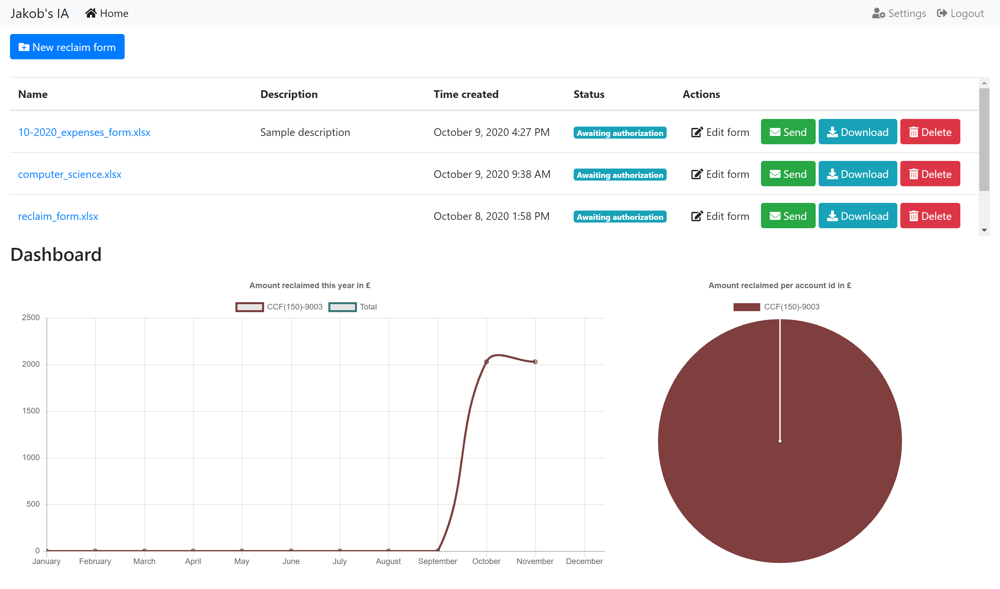

#Jakob Samonig Computer Science IA

This project was made as part of my computer science IA. The purpose of this application is to automise expense
reclaiming at my school, which is done manually using excel sheets. The application uses Python's Flask, HTML, CSS, 
Javascript, and bootstrap.

## Setup
1) make a pull request to download the files
2) cd to directory containing IA
2) install packages from `requirements.txt`
3) set environment variable: `set FLASK_APP=run.py`
4) run `flask db init`
5) run `flask db migrate`
6) run `flask db upgrade`
6) Run `IA/app/updating/update_database.py`
7) run `flask run`
8) open `localhost:5000`

### Running
1) set environment variable: `set FLASK_APP=run.py`
2) run the command: `flask run`
3) open `localhost:5000`

### Debugging
1) set environment variable `set FLASK_APP=run.py`
2) set environment variable `set FLASK_ENV=development`
3) run the command: `flask run`
4) open `localhost:5000`

###### Note: the command `set` is windows specific, for linux use `export`.
